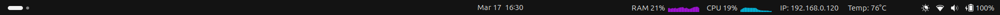
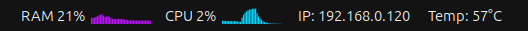

# GNOME Topbar Monitor

Lightweight GNOME Shell extension for real-time system monitoring with smooth, high-frequency graphs directly in the top panel.




---

## Features

* **Real-time CPU and RAM monitoring**
* **Smooth animated graphs** using Cairo rendering
* **Temperature display** (via `/sys/class/thermal`)
* **Local IP detection** (click to copy to clipboard)
* **Minimal and clean UI** integrated into GNOME topbar
* **Clickable actions**

  * Open system monitor
  * Copy IP address instantly

---

## How It Works

This extension reads system data directly from Linux interfaces:

* `/proc/stat` → CPU usage
* `/proc/meminfo` → RAM usage
* `/sys/class/thermal/...` → Temperature
* `ip` command → Network IP

Rendering is handled via **Cairo** inside a custom `St.DrawingArea`, enabling smooth and efficient graph updates.

---

## Compatibility
- **Display Server:** Works on both **Wayland** and **X11**.
- **GNOME Version:** Tested on GNOME 46.

---

## Installation

### Manual install

```bash
mkdir -p ~/.local/share/gnome-shell/extensions/guivieirasi@topBarMonitor
cp -r extension/* ~/.local/share/gnome-shell/extensions/guivieirasi@topBarMonitor
```

Then restart GNOME Shell:

* Press `Alt + F2`
* Type `r` and press Enter (X11 only)

Or log out and back in (Wayland).

---

## Technical Highlights

* Custom graph rendering with **Cairo**

* Lightweight update loop using **GLib timeouts**

* Smoothing algorithm for better visual stability:

  ```
  smoothed = last * 0.7 + current * 0.3
  ```

* Direct system file parsing (no external dependencies)

* Efficient UI updates using GNOME Shell internals (`St`, `Clutter`)

---

## Motivation

This project was built to explore:

* GNOME Shell extension development
* Low-level system monitoring in Linux
* Real-time UI rendering and performance optimization

---

## Future Improvement

* Multiple IP types on display (selectable)

---

## License

MIT

---

##  Português

Extensão leve para monitoramento de sistema em tempo real diretamente na barra superior do GNOME.

### Funcionalidades:

* Monitoramento de CPU e RAM com gráficos suaves
* Temperatura do sistema
* IP local (clicável para copiar)
* Interface minimalista integrada ao GNOME

---

## Author

**guivieirasi**

---
